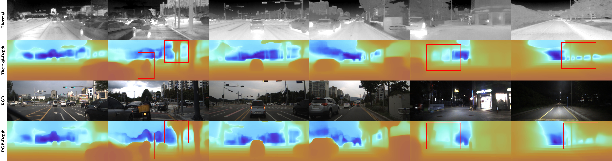

## MonoTher-Depth: Enhancing Thermal Depth Estimation via Confidence-Aware Distillation

This work presents MonoTher-Depth,  a metric Monocular depth estimation (MDE) pipeline  on thermal images. We enhance thermal MDE through knowledge distillation from a versatile RGB MDE model. 




## Installation

```bash
conda env create -n monother_depth --file environment.yml
conda activate monother_depth
```


### Evaluation on MS2 dataset

The network weights we trained on MS2 dataset can be downloaded from [here](https://huggingface.co/datasets/RockyZuo/Monther-Depth). Please save it as 'depth_anything_finetune/ZoeDepthDualv1_05-Aug_17-28-23b9f4b49f50_latest.pt'. MS2 dataset can be downloaded from this [link](https://sites.google.com/view/multi-spectral-stereo-dataset/download). The train/test splits follow the text files (officially provided by the dataset) in train_test_inputs/ms2_thermal.  Please see the quantitative evaluation results in our paper.

```shell
python evaluate_rgbt.py -m zoedepth_rgbt -d ms2thermal  --dataloader_type 2 --pretrained_resource="local::./depth_anything_finetune/ZoeDepthDualv1_05-Aug_17-28-23b9f4b49f50_latest.pt" --config_version="ms2_teach_nofs" --modality "rgbtd" --save_images ~/tmp_results/DepthAnything/ZoeDepthDualv1_05-Aug_17-28-23b9f4b49f50_latest_test_day --testmode test_day
 
python evaluate_rgbt.py -m zoedepth_rgbt -d ms2thermal  --dataloader_type 2 --pretrained_resource="local::./depth_anything_finetune/ZoeDepthDualv1_05-Aug_17-28-23b9f4b49f50_latest.pt" --config_version="ms2_teach_nofs" --modality "rgbtd" --save_images ~/tmp_results/DepthAnything/ZoeDepthDualv1_05-Aug_17-28-23b9f4b49f50_latest_test_night --testmode test_night
 
python evaluate_rgbt.py -m zoedepth_rgbt -d ms2thermal  --dataloader_type 2 --pretrained_resource="local::./depth_anything_finetune/ZoeDepthDualv1_05-Aug_17-28-23b9f4b49f50_latest.pt" --config_version="ms2_teach_nofs" --modality "rgbtd" --save_images ~/tmp_results/DepthAnything/ZoeDepthDualv1_05-Aug_17-28-23b9f4b49f50_latest_test_rainy --testmode test_rainy
  
```


### Zero-shot Test on Vivid Outdoor Dataset

Please download post-processed Vivid outdoor dataset from [here](https://github.com/UkcheolShin/ThermalSfMLearner-MS), including the outdoor_robust_day1, outdoor_robust_day2, outdoor_robust_night1 and outdoor_robust_night2 four sequences. The train/test splits follow the text files in train_test_inputs/vivid. Please see the quantitative evaluation results in our paper.

```shell
python evaluate_rgbt.py -m zoedepth_rgbt -d vivid_outdoor  --dataloader_type 2  --pretrained_resource="local::./depth_anything_finetune/ZoeDepthDualv1_05-Aug_17-28-23b9f4b49f50_latest.pt" --config_version="vivid_outdoor" --modality "rgbtd" --save_images ~/tmp_results/DepthAnything/vivid_outdoor_ZoeDepthDualv1_05-Aug_17-28-23b9f4b49f50 --testmode test
```


### Fine-tuning and Test on Vivid Outdoor Dataset

```shell
python train_mono.py -m zoedepth_rgbt -d vivid_outdoor  --dataloader_type 2 --pretrained_resource="local::./depth_anything_finetune/ZoeDepthDualv1_05-Aug_17-28-23b9f4b49f50_latest.pt"  --bs 4 --config_version="vivid_outdoor" --modality "rgbtd" --log_images_every 0.1 --validate_every 5.0 --epochs 7

python evaluate_rgbt.py -m zoedepth_rgbt -d vivid_outdoor  --dataloader_type 2  --pretrained_resource="local::./depth_anything_finetune/ZoeDepthDualv1_12-Aug_17-48-9658432fb0af_best.pt" --config_version="vivid_outdoor" --modality "rgbtd" --save_images ~/tmp_results/DepthAnything/vivid_outdoor_ZoeDepthDualv1_12-Aug_17-48-9658432fb0af_best.pt --testmode test

```

The model weights after our finetuning is  ZoeDepthDualv1_12-Aug_17-48-9658432fb0af_best.pt, which can be downloaded from [here](https://huggingface.co/datasets/RockyZuo/Monther-Depth). Please see the quantitative evaluation results in our paper.


### Training on MS2 Dataset

You can download the official MS2 dataset from this [link](https://sites.google.com/view/multi-spectral-stereo-dataset/download). We use the left RGB images, left thermal images, and the projected LiDAR depth maps. We follow the official train/val/test splits. The train split consists of 7.6K image pairs, while the test split includes 2.3K, 2.3K, and 2.5K image pairs under 'day', 'night', and 'rainy' conditions, respectively.
Due to misalignment between the projected ground-truth filtered LiDAR depth ( in depth_filtered folders) and the image in the officially provided dataset—particularly at image edges—training directly with the provided LiDAR depth maps often produces blurred depth predictions. To mitigate this issue, we further filter the LiDAR depth map (in depth_filtered folders) using two strategies: (i) remove depths that exhibit significant pixel-intensity inconsistencies when back-projecting LiDAR points into both the left and right images, and (ii) remove depths that substantially deviate from those obtained via stereo matching, [RAFT-Stereo](https://github.com/princeton-vl/RAFT-Stereo).  Please download our filtered projected LiDAR depth on this [page](https://huggingface.co/datasets/RockyZuo/Monther-Depth) and merge it with the officially downloaded dataset. The difference between the officially provided depth (depth_filtered) and our filtered depth (depth_filtered_myrefine) is depicted [here](./assets/MS2_Gt_Depth_Issue.pdf). While we utilize our filtered projected LiDAR depths (in depth_filtered_myrefine folders) during training to achieve sharper predicted depths, we continue to use the officially provided LiDAR depth (in depth_filtered folders) for evaluation to ensure fairness and thoroughness. Although our setting yields crisper depth predictions, we find it slightly compromises certain evaluation metrics. 

Finally, the directory structure of the MS2 dataset is like:

>     xxx/Depth-Anything/metric_depth/data/ms2thermal/
>     ├── odom
>     │   ├── _2021-08-06-10-59-33
>     │   ├── <seq name>
>     ├── sync_data
>     │   ├── _2021-08-06-10-59-33
>     │   │   ├── calib.npy
>     │   │   ├── gps_imu
>     │   │   │   ├── data
>     │   │   │   ├── dataformat.txt
>     │   │   │   └── data_timestamp.txt
>     │   │   ├── readme.txt
>     │   │   ├── rgb
>     │   │   │   ├── img_left
>     │   │   │   ├── img_left_skymask
>     │   │   │   ├── img_left_timestamp.txt
>     │   │   │   ├── img_right
>     │   │   │   ├── img_right_timestamp.txt
>     │   │   └── thr
>     │   │       ├── img_left
>     │   │       ├── img_left_timestamp.txt
>     │   │       ├── img_right
>     │   │       ├── img_right_timestamp.txt
>     │   ├── <seq name>
>     ├── proj_depth
>     │   ├── _2021-08-06-10-59-33
>     │   │   ├── readme.txt
>     │   │   ├── rgb
>     │   │   │   ├── depth
>     │   │   │   ├── depth_filtered
>     │   │   │   ├── depth_filtered_myrefine
>     │   │   └── thr
>     │   │       ├── depth
>     │   │       ├── depth_filtered
>     │   │       ├── depth_filtered_myrefine
>     │   ├── <seq name>
>     ├── test_day_list.txt
>     ├── test_night_list.txt
>     ├── test_rainy_list.txt
>     ├── train_list.txt
>     ├── train_split0_list.txt
>     ├── train_split1_list.txt
>     └── val_list.txt


We load the pre-trained weights of Depth-Anything-Large model (download from [here](https://github.com/LiheYoung/Depth-Anything) and save it as ./checkpoints/depth_anything_vitl14.pth) to initialize the weights of RGB-thermal dual-branch network architecture. We train our dual-branch network  on a server with 2x 48G@VRAM Nvidia GPUs.

```shell
 python train_mono.py -m zoedepth_rgbt -d ms2thermal  --dataloader_type 2 --pretrained_resource="local::./checkpoints/depth_anything_vitl14.pth"  --bs 4 --config_version="ms2_teach_nofs" --modality "rgbtd" --log_images_every 0.1 --validate_every 1.0 --epochs 5
```

The network weights we trained on MS2 dataset can be downloaded from [here](https://huggingface.co/datasets/RockyZuo/Monther-Depth). Please save it as 'depth_anything_finetune/ZoeDepthDualv1_05-Aug_17-28-23b9f4b49f50_latest.pt'. 


## Citation

If you find this project useful, please consider citing:

```bibtex
@article{zuo2025monotherdepth,
  author={Zuo, Xingxing and Ranganathan, Nikhil and Lee, Connor and Gkioxari, Georgia and Chung, Soon-Jo},
  journal={IEEE Robotics and Automation Letters}, 
  title={MonoTher-Depth: Enhancing Thermal Depth Estimation via Confidence-Aware Distillation}, 
  year={2025}
}
```


### Acknowledgments

This work is heavily adapted from [Depth-Anything](https://github.com/LiheYoung/Depth-Anything) and [ZoeDepth](https://github.com/isl-org/ZoeDepth). We thanks the authors for open-sourcing their code.
